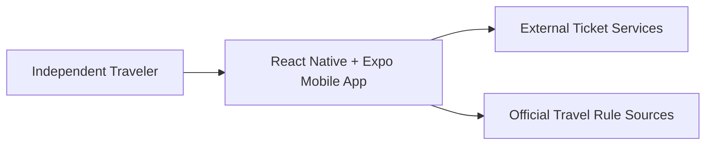
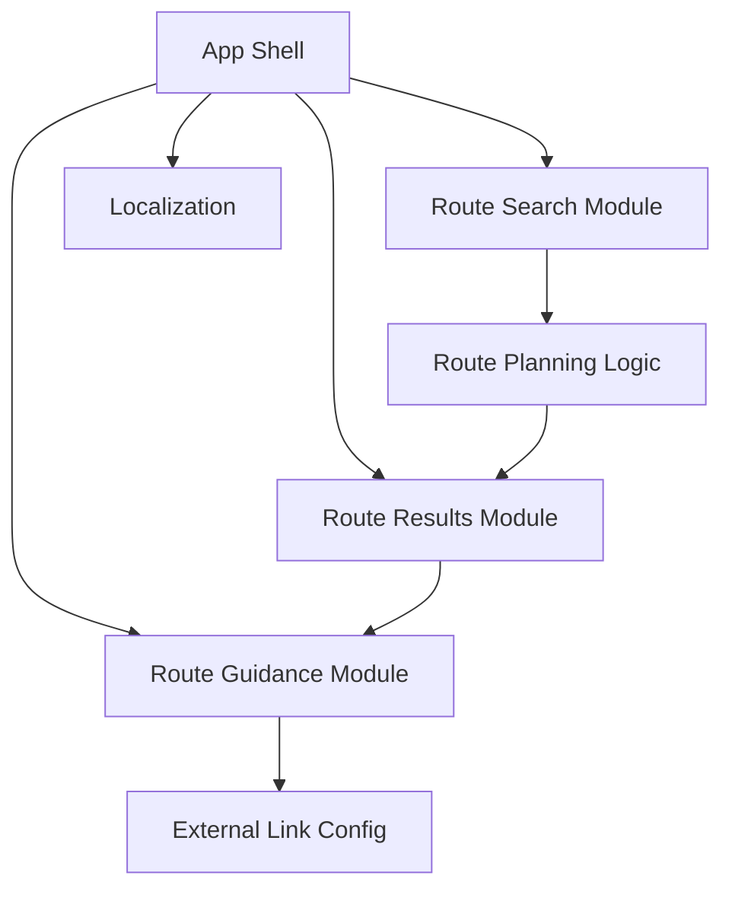

# Architecture

## Source References

- `docs/prd.md`: source for product scope, mobile app format, supported languages, route-card behavior, supported transport types, and out-of-scope features.
- `docs/user-journey.md`: source for the primary journey, success state, friction, and trust risks.
- `docs/screen-map.md`: source for screens, states, transitions, and exits.
- `docs/wireframes.md`: source for structural UI needs and state treatment.
- `docs/design-brief.md`: source for UX/UI direction and mobile design constraints.
- Explicit user answer: React Native + Expo is the confirmed technical direction for MVP; no backend in the first architecture decision.

## Architecture Overview

The MVP is a React Native + Expo mobile app focused on a single route-planning flow. It collects route intent, presents 2-3 route cards, shows selected-route guidance, and links users to external ticket services.

The first architecture avoids backend ownership. Route data, cost estimates, external ticket-service choices, and official-rule sources remain open integration questions unless they are represented as static or manually maintained client-side configuration during MVP prototyping.

## Architecture Principles

- Keep the MVP client-first and mobile-first.
- Do not add backend, accounts, saved routes, checkout, accommodation, restaurant, city-navigation, or travel-guide systems.
- Treat external ticket services and official travel-rule sources as outbound links, not owned integrations.
- Make uncertainty explicit: estimated prices are not guaranteed live prices.
- Keep route state ephemeral unless a future source confirms persistence.
- Preserve Ukrainian and English interface support.

## System Context

## Module And Boundary Map

| Boundary | Responsibility | Source References |
| --- | --- | --- |
| App Shell | Mobile navigation, language switch, app-level state boundaries. | `docs/screen-map.md`, `docs/design-brief.md` |
| Route Search | Required input collection and validation. | `docs/prd.md`, `docs/wireframes.md` |
| Route Results | Display route-card comparison for cheapest, fastest, and balanced options. | `docs/prd.md`, `docs/screen-map.md` |
| Route Guidance | Display route tips, reminders, and external links for a selected route. | `docs/prd.md`, `docs/user-journey.md` |
| Route Planning Logic | Produces or formats MVP route options. Exact data source is open. | `docs/prd.md` Open Questions |
| External Link Config | Stores ticket-service and official-source link targets once confirmed. | `docs/prd.md` Open Questions |
| Localization | Provides Ukrainian and English interface copy. | `docs/prd.md` |

## Runtime And Automation Model

The confirmed runtime is a React Native + Expo mobile app. No backend runtime, scheduled job, account service, persistence service, or deployment automation is confirmed for MVP.

## Data And State Model

| Object | Fields Or Shape | Ownership |
| --- | --- | --- |
| Route Request | starting point, destination, departure date, optional return date | Client app state |
| Route Option | category, duration, estimated cost or "check price", transfer count, transport types, guidance, external links | Client app state or future route source |
| Route Guidance | practical tips, visa/transit/border reminders, official-source links | Client app state or config |
| Locale | Ukrainian or English | Client app state |

No account, saved-route, search-history, payment, accommodation, restaurant, or city-navigation data model is part of MVP.

## Integration Map

| Integration | Direction | MVP Treatment |
| --- | --- | --- |
| Ticket services | Outbound link | User opens external services to verify and buy tickets. |
| Official travel-rule sources | Outbound link | User checks official visa, transit, or border information. |
| Live ticket APIs | Not confirmed | Open question; not required for MVP. |
| Backend API | Not confirmed | Deferred unless future source confirms it. |

## Technology Stack And Constraints

- Mobile framework: React Native + Expo.
- Backend: not included in the first architecture decision.
- Persistence: not included in MVP.
- Authentication: not included in MVP.
- Deep ticketing integrations: not included in MVP.

## Security Privacy And Access Model

The MVP does not require accounts, authentication, or stored user profiles. The app should minimize collection of personal data by keeping route search state ephemeral.

External links should be clearly marked so the user understands they are leaving the app.

## Performance Reliability And Observability

The route-planning flow should remain responsive on mobile. Loading, error, empty, offline, and long-content states are required by `docs/screen-map.md`.

Runtime analytics, crash reporting, and observability tooling are open questions because no implementation or operations stack exists yet.

## Architecture Diagram

## Architecture Decision Log

### Decision: Use React Native + Expo for the MVP mobile app

- `Source References`: explicit user answer, `docs/prd.md`
- `Alternatives Considered`: unspecified native iOS/Android, Flutter, web app
- `Why This Direction`: React Native + Expo satisfies the confirmed mobile-app format while keeping MVP setup lightweight.
- `Consequences`: Future implementation should follow Expo-compatible mobile patterns unless a later decision changes the stack.
- `Open Follow-Up`: Exact Expo routing, state management, and test tooling remain unconfirmed.

### Decision: Exclude backend from the first architecture decision

- `Source References`: explicit user answer, `docs/prd.md` out-of-scope and open questions
- `Alternatives Considered`: backend API, live ticket integrations, account service
- `Why This Direction`: The PRD does not require accounts, saved routes, in-product ticket purchase, or guaranteed live prices.
- `Consequences`: MVP data may need static configuration, manual route logic, or clearly scoped future integrations.
- `Open Follow-Up`: Route option source and cost estimation method remain open.

## Risks And Mitigations

| Risk | Mitigation |
| --- | --- |
| Users may expect live ticket pricing. | Use "check price" when live pricing is unavailable. |
| Users may expect in-app booking. | Treat ticket services as external links and avoid checkout UI. |
| Route option data source is not confirmed. | Keep route-source and cost-estimation questions open before implementation. |
| Travel-rule reminders may be mistaken for legal advice. | Link to official sources and use reminder language only. |

## Out Of Scope

- Backend service
- User accounts
- Saved routes or search history
- In-product ticket purchase
- Accommodation booking
- Restaurant reviews
- City navigation
- Full travel guides
- Guaranteed real-time ticket prices

## Open Questions

- What data source or rule set will produce route options in the MVP?
- How will estimated cost be calculated when live pricing is unavailable?
- Which exact external ticket services should be linked?
- Which official sources should be linked for visa, transit, and border reminders?
- Should analytics or crash reporting be included in the first implementation?
- Which Expo routing, state management, and test tooling should the implementation use?
