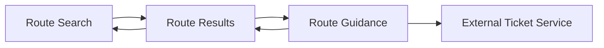

# Screen Map

## Source References

- `docs/prd.md`: source for MVP scope, mobile app format, route-card requirements, user stories, out-of-scope screens, and testing expectations.
- `docs/user-journey.md`: source for journey stages, decision points, success state, failure path, and exit points.

## Screen Inventory

| Screen | Purpose | Source References |
| --- | --- | --- |
| Route Search | Collect starting point, destination, departure date, and optional return date. | `docs/prd.md` User Stories 1-2; `docs/user-journey.md` Journey Stage 1 |
| Route Results | Show 2-3 short route cards for cheapest, fastest, and balanced options when available. | `docs/prd.md` User Stories 5-14; `docs/user-journey.md` Journey Stages 2-3 |
| Route Guidance | Show practical tips, ticket-service links, and visa/transit/border reminders tied to the selected route. | `docs/prd.md` User Stories 13, 15-16; `docs/user-journey.md` Journey Stages 4-5 |

## Surface Closure Matrix

| Journey Need | Supporting Screen Or Surface | Notes |
| --- | --- | --- |
| Enter travel intent | Route Search | Covers point A, point B, departure date, and optional return date. |
| Compare route options | Route Results | Covers cheapest, fastest, and balanced route cards. |
| Understand route practicality | Route Results | Uses duration, transfer count, transport types, and estimated cost or "check price". |
| Read practical guidance | Route Guidance | Covers route-specific tips and general travel reminders. |
| Continue ticket search externally | Route Guidance | External links are exits from the app. |

## Route Map

## Navigation Model

The MVP is a single primary mobile flow:

1. Route Search
2. Route Results
3. Route Guidance
4. External ticket-service exit

Return navigation should support moving from Route Results back to Route Search and from Route Guidance back to Route Results.

## Journey-To-Screen Trace

| Journey Stage | Screen | Coverage |
| --- | --- | --- |
| Enter travel intent | Route Search | Input fields and route request submission. |
| Wait for route options | Route Results | Loading and error states while route cards are prepared. |
| Compare route cards | Route Results | Short cards for route categories and comparison fields. |
| Check practical guidance | Route Guidance | Tips and reminders tied to a selected route. |
| Continue outside the app | Route Guidance | External ticket-service links. |

## Screen States

### Route Search

- Default: form is ready for starting point, destination, departure date, and optional return date.
- Empty: no route input has been entered yet.
- Disabled: submit action is unavailable until required fields are present.
- Error: required fields are missing or invalid.
- Loading: route request is being submitted.
- Offline: route request cannot be submitted.

### Route Results

- Loading: route options are being generated.
- Success: 2-3 route cards are available.
- Empty: no practical route options are available.
- Error: route options cannot be generated.
- Long-content: result cards require scrolling on smaller mobile screens.
- Offline: new route results cannot be fetched.

### Route Guidance

- Success: selected route guidance and external ticket-service links are available.
- Empty: no additional route-specific guidance is available.
- Error: guidance cannot be shown for the selected route.
- Long-content: reminders and links require scrolling.
- Offline: external links may not open or route details may not refresh.

## Transition Notes

- Submitting valid Route Search input transitions to Route Results.
- Selecting a route card transitions to Route Guidance.
- External ticket-service links leave the app.
- Back navigation should not require account creation or saved history.

## Entry And Exit Points

Entry point:

- User opens the mobile app and starts at Route Search.

Exit points:

- User exits before submitting a route.
- User exits from Route Results after comparing cards.
- User opens an external ticket service from Route Guidance.

## Edge Paths

- If no practical routes are available, Route Results should show an empty state rather than inventing options.
- If prices are unavailable, Route Results should use "check price" rather than implying a guaranteed estimate.
- If legal certainty is needed, Route Guidance should point to official sources rather than providing legal advice.

## Out Of Scope Screens

- Account creation
- Login
- Saved routes
- Search history
- Accommodation booking
- Restaurant reviews
- City navigation
- In-product ticket checkout
- Full travel guide or attractions screens

## Open Questions

- What exact route names or mobile route identifiers should be used in implementation?
- Which external ticket services should appear in Route Guidance?
- Should optional return routing create a separate result set in the MVP?
- What level of detail should be available after selecting a route card?
